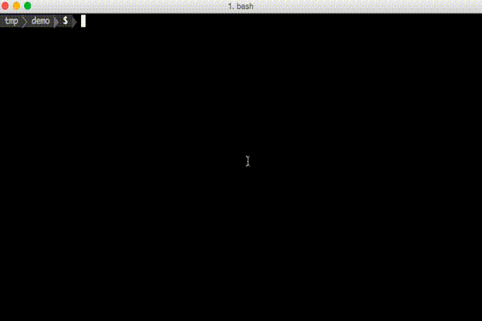

# pubsub-cloud-function

> a [porteurbars](https://github.com/softprops/porteurbars) template for generating google [pubsub](https://cloud.google.com/pubsub/docs/overview) triggered google [cloud functions](https://cloud.google.com/functions/), bootstrapped for travis integration for continuous git push based deployments



## usage

The following should prompt you for the following values

```bash
$ porteurbars meetup/pubsub-cloud-function
```

| Name            | Default value | Description                                                            |
|-----------------|---------------|------------------------------------------------------------------------|
| GCP_PROJECT     | ai-blt        | name of google cloud platform project                                  |
| STAGE_BUCKET    | hello-pubsub  | name of google storage bucket to store staged coded under              |
| FUNCTION_NAME   | helloPubsub   | name of exported function to deploy, this should be unique per project |
| FUNCTION_MEMORY | 128MB         | amount of memory to allocation in deployments                          |
| PUBSUB_TOPIC    | hello-pubsub  | name of gcp pubsub topic to subscribe to                               |


`GCP_PROJECT` Name must start with a letter followed by up to 47 letters, numbers, or hyphens, and cannot end with a hyphen.

`FUNCTION_MEMORY` values must be one of `28MB`, `256MB`, `512MB`, `1024MB` and `2048MB`.

`PUBSUB_TOPIC` must follow the `resource-name` rules defined [here](https://cloud.google.com/pubsub/docs/overview#names)

`STAGE_BUCKET` must following the rules defined [here](https://cloud.google.com/storage/docs/naming#requirements)

## testing

This template provides a default test harness. You can run tests with the following

```bash
$ make test
```

## impress your friends

```bash
$ porteurbars meetup/pubsub-cloud-function && make deploy
```
